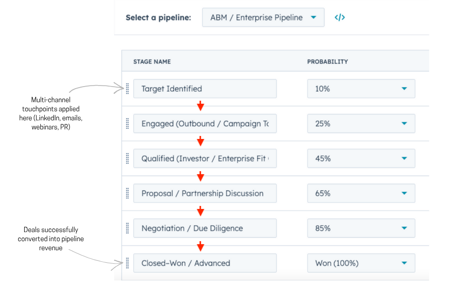

# 🧬 Biotech Go-to-market and Pipeline Growth
Repositioned a niche biotech solution as an enterprise-scale climate asset, accelerating enterprise deals and investor traction.

**Client:** Series B multinational biotech startup (insect-based protein)  
**Objective:** Increase investor confidence and accelerate enterprise deal flow in a conservative, risk-sensitive market.

---

### 1. The Challenge
Enterprise buyers and late-stage investors hesitated due to **perceived category risk and scalability uncertainty**. The solution was perceived as experimental rather than deployable at scale. Inconsistent messaging across channels further slowed investor engagement and deal progression.

---

### 2. Strategy
**Enterprise Lead Acquisition & Account-Based Marketing (ABM)**

To counteract perceived risk and build confidence in scalability, I designed a **multi-channel ABM strategy** targeting enterprise buyers and late-stage investors. Each touchpoint reinforced **climate impact, industrial readiness and alternative protein positioning**, using consistent narratives across channels.

**Channels:**
* LinkedIn account targeting and credibility campaigns
* Segmented email sequences
* Webinars
* PR and partner outreach

**Tools:**
* HubSpot (CRM and lead qualification)
* Google Analytics 4 (GA4)
* ConvertKit
* GoToWebinar

**Methods:**
* ABM workflows
* Lead acquisition funnels
* A/B testing
* Performance optimization

---

### 3. Execution
* Built ABM workflows for investors, partners and enterprise accounts  
* Produced thought leadership content: founder webinars, gated reports, case briefs  
* Launched LinkedIn credibility campaigns with tailored positioning  
* Led PR and partner outreach using a climate-scale narrative
* Built CRM dashboards to track attribution and pipeline velocity  

---

### ABM Pipeline Workflow (HubSpot)

<em>Stages used for enterprise + investor ABM qualification and deal progression. Probabilities reflect conversion likelihood across the funnel.</em> 

---
### LinkedIn Sponsored Campaign

<em>Example of LinkedIn sponsored content used in ABM campaigns targeting enterprise and investor accounts.</em> 
<em>Logo and company name blurred for confidentiality.</em>  

> Note: Part of multi-channel ABM strategy integrating LinkedIn, email sequences, webinars, and PR/partner outreach to drive pipeline and qualified engagement.

--- 

### 4. Results & Impact

- **€5M+** in enterprise and investor pipeline generated in Q3–Q4 following ABM rollout and market repositioning
- Faster deal cycles **(~25%)** as targeted workflows reduced friction and improved qualification
- **60+ priority accounts** engaged, segmented by readiness, mandate, and strategic fit
- **Three strategic partnerships** advanced to proposal stage, with several additional accounts in late-stage discussions
- **Investor confidence strengthened**, leading to meetings with leading sustainability funds and corporate VCs
- Improved perception of scalability and category maturity, shifting the narrative from “experimental” to “industrial-ready”
- Established **full-funnel visibility** via HubSpot dashboards for attribution, velocity, and conversion tracking

--- 

### Pipeline Performance and Engagement Metrics

<em>Visual summary of pipeline velocity, attribution and stage progression from ABM execution.</em> 

---

### 5. Key Insight
The primary barrier was **market validation and positioning, not demand**. Reframing the solution as climate-scale infrastructure reduced perceived risk, accelerated enterprise deal flow and increased investor conviction.
